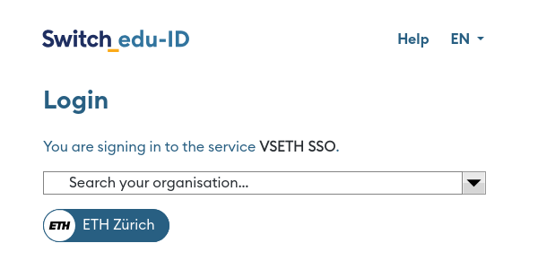

# ETH Userscripts

## Installation

These extensions are distributed as [Userscripts](https://en.wikipedia.org/wiki/Userscript). They can be installed using a userscript manager.

I recommend [Violentmonkey](https://violentmonkey.github.io/). Alternatives are [Tampermonkey](https://www.tampermonkey.net/) or [Greasemonkey](https://www.greasespot.net/).

After installing one of the userscript managers, clicking the `Install` links below will install the userscript for you.

## Moodle Fix PDF Links

[Install](https://userscripts.lusc.ch/eth/moodle-fix-pdf-links/moodle-fix-pdf-links.user.js)

Some courses on Moodle are configured to open PDFs in a popup window.

This userscript fixes that so clicking the link opens the PDF in the same page.

## Moodle No Force Download

[Install](https://userscripts.lusc.ch/eth/moodle-no-force-download/moodle-no-force-download.user.js)

Some courses on Moodle are configured to force the download of PDFs even though browsers are perfectly capable of rendering PDFs.

This userscript fixes that to ensure that PDFs aren't downloaded but rather rendered in the browser.

## Prettier Code Expert

[Install](https://userscripts.lusc.ch/eth/prettier-code-expert/prettier-code-expert.user.js)

This userscript adds a button to format your code on Code Expert using [Prettier](https://prettier.io/). The code is only formatted when the button is pressed.

Currently, supported languages:

- Java

:warning: Formatting does not save the file. Save the file by editing it or with `Ctrl+S`.

## Switch Login ETH Button

[Install](https://userscripts.lusc.ch/eth/switch-login-eth-button/switch-login-eth-button.user.js)

This userscript adds a button on the Switch login page allowing a more easy redirect to the ETH login page.

## Automatic Redirect

[Install](https://userscripts.lusc.ch/eth/automatic-redirect/automatic-redirect.user.js)

This userscripts automatically redirects steps that shouldn't need user interaction.

Currently redirects:

- Moodle Shibboleth login (where you select your organisation). Redirects to ETH automatically.

## License

Licensed under the GNU General Public License,
version 3 or (at your option) any later version:
([COPYING](COPYING) or <https://www.gnu.org/licenses/gpl-3.0.html>)

## Contribution

Unless you explicitly state otherwise, any contribution intentionally submitted
for inclusion in the work by you, as defined in the license above, shall be
licensed as above, without any additional terms or conditions.

If you wish to add or improve a userscript, please open an issue first.
